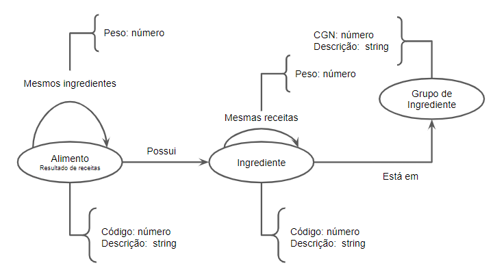

# Equipe Shrek

# Subgrupo DBSET

- Gabriel Gomes - 248287
- Paulo Santos - 248438
- Rodrigo de Barros - 272701

# Resultados das análises

## Perguntas feitas no Lab 07

1) Quais ingredientes são mais populares (aparecem em conjunto com diversos outros ingredientes)?
   
Quando fazemos a ligação entre os ingredientes com a condição de participarem da mesma receita, conseguimos tanto de forma visual, como por meio de calculos, quais são os ingredientes mais "populares". A centralidade desses ingredientes pode ser também uma métrica para isso: os ingredientes mais centrais nesse caso são geralmente os que tem mais conexões com outros ingredientes, ou seja, participam de diversas receitas. Essa análise poderia ser baseada em cima dos vatores calculados, por exemplo, pelo algoritmo de Pagerank tendo até uma noção de quão popular é aquele ingrediente. Além disso, olhando para o próprio grafo formado conseguimos ter uma ideia visual de quais são os ingredientes mais basais, que são usados em diversas receitas.

2) Quais receitas usam os ingredientes mais comuns (ingredientes usados em muitas outras receitas)?

Aqui consegui esse resultado fazendo algo parecido com a primeira pergunta, só que com receitas. As receitas que tiverem ingredientes em comum, serão ligadas umas as outras. As receitas que tem mais ligações, são receitas que possuem os ingredientes mais comuns, tem os ingredientes mais basais. Como as receitas se ligam, conseguimos fazer a análise a partir do grau das ligações que as arestas tem, nesse caso, ele corresponde ao numero total de ingredientes que cada par de receitas compartilham. Com isso, podemos ver, também, quais são as receitas mais parecidas, em termos de ingredientes, onde, por exemplo, se você consegue fazer a receita X, com poucas coisas a mais/menos, você faz a receita Y.

3) Quais são os grupos mais populares para fazer uma receita (no caso, os grupos que são mais conectados com receitas)?

Aqui conseguimos fazer uma conexão entre as receitas e os grupos/subgrupos de ingredientes, usando como base/condição, se um ingrediente participa daquela receita, aquela receita se liga com o grupo daqule ingrediente. Além dos resultados óbvios, conseguimos ver quais são os grupos de receitas que não tem uma variedade grande de grupos/subgrupos nos seus ingredientes, podendo dar uma interpretação daquela receita não ser diversa. Ainda nesse grafo, conseguimos analisar a vulnerabilidade dos grupos, o grupo mais vulnerável significa que, caso ele, por algum motivo suma, a maioria das receitas seriam afetadas, podendo não mais serem feitas pela falta daquele grupo em específico.

## Outras análises
 
Analisando o grafo que liga receita com o ingrediente:

- Nesse grafo aqui, podemos usar a 'predição de link' para fazer algumas análises: por exemplo, podemos analisar a quantidade de receitas que tem trigo, leite e manteiga em seus ingredientes; se essa quantidade for grande, é bem provável que, de alguma maneira, outras receitas que só usem trigo e leite  podem, na verdade, também usar manteiga, o que pode até mesmo gerar algum tipo de receita diferente, que ainda não foi testada (pelo menos em grande escala);
- Além disso, também podemos fazer uma análise parecida com a questão 3 usando a vunerabilidade, entendendo os ingredientes mais vulneráveis, conseguimos fazer uma análise de quais ingredientes seriam mais impactantes caso houvesse o "sumiço" deles, podendo também entender quais seriam as receitas que não poderiam ser mais feitas, dado a falta desse ingrediente específico;

Analisando o grafo que liga receitas com outras receitas:

- Esse é o mesmo grafo da questão 2, onde a condição para ligação seria as receitas terem ao menos um ingrediente em comum. Poderiamos gerar, em cima disso, um grafo de comunidades para analise dos grupos de receitas que são similares, talvez podendo, depois que as comunidades estivessem mais definidas, refletir nos grupos e/subgrupos dos ingredientes: se temos uma determinada comunidade em receitas no grafo, significa que aquelas receitas compartilham os mesmos ingredientes em comum, ou seja, aqueles ingredientes tem uma "composição" similiar e, talvez, se analisarmos os grupos/subgrupos desses ingredientes em questão, vamos conseguir ver uma similaridade.

## Modelo Lógico (Revisado)

